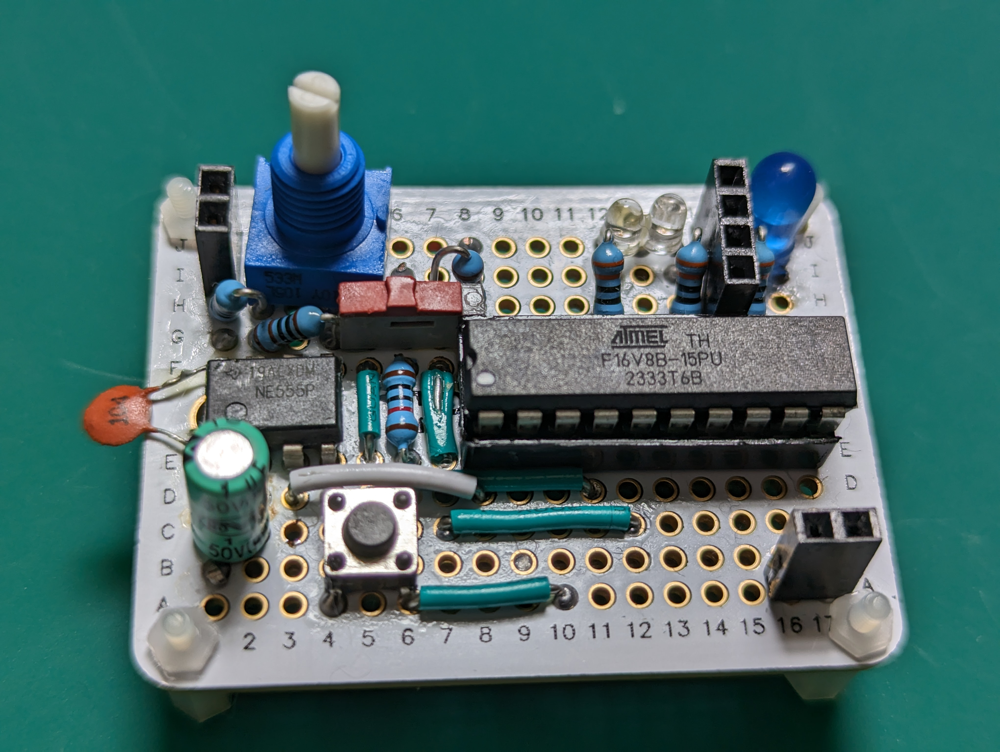

# Compact Clock Module for debugging

Here's my description of a debugging clock generator. This is not a
"clock" in the colloquial sense; it generates pulses to synchronise
sequential digital circuits.

I call this a "debugging" clock because it's not meant to run regularly and fast. Instead,
it allows me adjust its speed on the fly (by turning a small knob) and to step-by-step
the circuit it's connected to.

You can see a quick demo of it in action on [my YouTube channel](https://www.youtube.com/@dmoisset)

Its main features are:

* Two-mode selector (automatic or single-step) with indicators
* Adjustable frequency control (0.7Hz to 480Hz). The frequency can be changed while running
* HLT input: when high, the clock stops running. Allows electronic control of the clock; if unused,
  you can tie it to ground. Modifying the design to make this line active low is very easy if desired.
* Tiny footprint: fits a quarter-size (170 contact) solder-pad breadboard. Requires a few
  wires soldered on the bottom side.
* LED indicator of clock cycles.
* 5V TTL levels.
* Compatible drop-in replacement for [Ben Eater's clock module](https://eater.net/8bit/clock)

If you are familiar with Ben Eater's clock, this one is very similar in functionality
(but more compact and less educational). If you want to understand how this works rather
than just building it, I recommend you watch [his videos](https://eater.net/8bit/clock).

You can build this on a solderless breadboard if you prefer; although my design goal with
this project was to be able to solder it to get a more reliable and stable clock generator
that I can use in multiple projects.

## Building the module

* [List of materials](docs/materials.md)
* [Schematic](docs/schematic.md)
* [Physical layout and build tips](docs/layout.md)
* Programming the PLD (Programmable Logic Device)
  * [Software and hardware](docs/pld-tooling.md)
  * [Logic definitions (CUPL) for the PLD](docs/cupl.md)
* [Testing](docs/testing.md)
