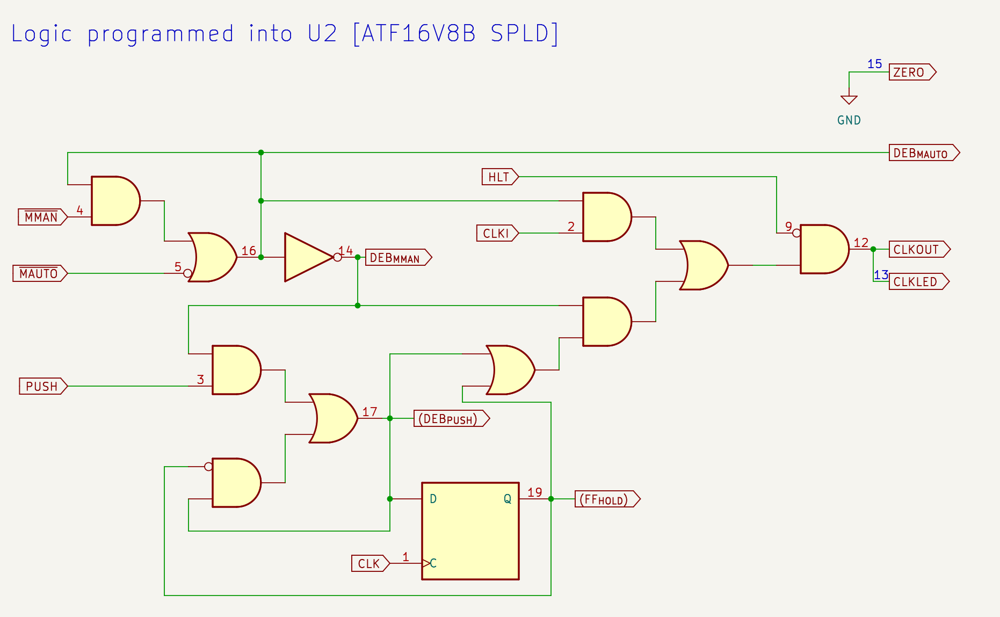

# The "CUPL" code for my clock module

The CUPL source for the ATF16v8 module is in this repo here: [be8clock.pld](https://github.com/siliconchronicles/clock-module/blob/main/cupl/be8clock.pld)

The following text explains the functionality implemented in this file and how it works.

## What the module does

The functionality implemented in this module includes:

* Receives the input clock from the 555 timer
* Accepts (and debounces) input from the mode toggle switch
* Accepts (and debounces) input for the single-step push button
* Receives a HALT signal
* Providing the output clock in two pins. One is used for the blue LED, and the other is for
  the clock connector.
    * Output is low if halted.
    * Output copies the input clock in automatic mode
    * In manual mode, output is set while pushing the button, and cleared once a full
      cycle (2 rising edges) of the input clock passes with the released button.
      Note that the length of this pulse is still controlled by the potentiometer.
* Generates output signals for the mode indicator LEDs

## Implementation details

### Schematic

The following schematic reflects the logic built by the CUPL program, and can be used as reference.

[](pictures/spld-logic.png)

Numbers correspond to pin numbers in the U2. You can open the image in a new tab to zoom in.

### Input signals

The input pins are defined as follows:

```
PIN 1 = clk ;    /* 555 based clock */
PIN 2 = clki ;    /* tied to pin 1; clk can not be used in formula */
PIN 3 = push ;    /* push-button: trigger clock pulse */ 
PIN 4 = !mman ;   /* toggle set to manual */ 
PIN 5 = !mauto  ; /* toggle set to auto */ 
PIN 9 = hlt ;     /* halt clock */ 
```

Pin 1 is the standard clock input for the ATF16V8 flip-flops. However, the value on pin 1
can not be used as an input for logic gates if it is used as a clock, so the input clock is
connected to pin 2 (both pins are bridged together).

Pin 3 is attached to the push buttons (which defaults to a low value with a 10K pull-down,
and pressing it drives it to Vcc).

Pins 4 and 5 are attached to the two end terminals of the mode switch. The common point of
the switch is attached to the ground, and both switches have a 10K pull-up. This means that
one side will go high and the other low when switching. The names of the input signals
are `mman` ("mode=manual", for single-step) or `mauto` ("mode=automatic" for running
oscillator).

The exclamation mark in the pin definitions indicates that the signals are active-low. Note that
in logic formulas used later, using a name as `mauto` will be interpreted as "the signal `mauto`
is active" (i.e. low), not to be confused with "the signal `mauto` is high". CUPL focuses
on providing formulas based on logic and leaving the active-high/active-low decision as
implementation details in the pin definitions.

Pin 9 is the HLT (halt) signal.

The ATF16V8B has three-state functionality that I'm not using. The "output-enable" pin is
always pin 11 and needs to be defined in the CUPL file:

```
PIN 11 = !oe ;
```

### Switch debouncing

The mode switch can have (as any mechanical switch) some bouncing, so the circuit can not
rely directly on pins 4 and 5 to identify the mode. There could be states while the switch
is moving that none of them are active. I used the PLD cells to implement a SR-latch 
(set/reset latch) that is set/reset based on the mode. This ensures that a single mode
is selected at any time. When the switch gets a known
position, that event is used as a set or reset signal. While the switch travels or bounces,
the latch will keep its current state.

Note that the state of a set/reset latch can be defined as the following logic formula:
 `Q' = S # (!R & Q)`.

Notes:
* The formula above uses the CUPL syntax where `#` means "or", `&` means "and", and `!`
  means "not".
* `Q'` is the "next state", and `Q` is the current state. `S` is the "set" signal, and `R` is "reset".
* You can then read the formula above: "the SR-latch will be high either only if it's being set,
  or if it was already high and not being reset.

With that, we can build the following pieces of the CUPL file defining the latches as
formulas.

```
PIN 14 = deb_mman ; /* debounced mman */
PIN 15 = zero     ; /* shared ground for indicator LEDs */
PIN 16 = deb_mauto ;  /* debounced mauto */

/* SR-latch logic (set priority). Q' = S # (!R & Q) */
deb_mauto = mauto # (!mman & deb_mauto);  
deb_mman = !deb_mauto;

zero = 'b'0;
```

The name `deb_mauto` means "debounced mode=automatic". An active `mauto` signal will be
the "set" operation in the latch. An active `mman` signal will be the "reset" operation.

The name `deb_mman` means "debounced mode=manual". I don't need another latch for this
signal. It's always the opposite of `deb_mauto`. Doing this guarantees that consistently exactly one of
the `deb_xxx` signals will be active at any given time.

These two signals are sent to pins 14 and 16 which are used for the mode indicator LEDs
(the two small green LEDs). Pin 15 is set to a value which is always low. This is a
small hack to have a "ground" value for the LEDs, which reduces a bit the wiring/soldering
needed.

### Single step button

The single step push button uses debouncing, and also relies on a SR-latch called `deb_push`.
The mechanics of this latch are a bit different than before.

Pushing the button while on single step mode acts as a
"set" signal. However releasing is not a reset (otherwise the bounces will just toggle
the latch quickly). Instead, the next clock rising edge after the button is pushed will set
active one of the PLD flip-flops called `ff_hold`. The output of `ff_hold` will act as
the reset signal, which will clear `deb_push`. When `deb_push` is low, `ff_hold` will go
low the next rising edge.

The formula definition we used for SR-latches gives priority to "set" signals. If both
the "set" and "reset" are high, the latch will be set and ignore the reset. That means
that if `ff_hold` is already set, but the button is still pushed, the latch will stay
active (and thus, `ff_hold` will too).

Our clock output will be the result of `deb_push # ff_hold`. So the clock will be active
as soon as the button is pressed, and will keep active while it's pressed (because of
`deb_push`). Once it's released, the next rising edge will bring `ff_hold` up (if it
wasn't already due to a long push). That will reset `deb_push` but keep `ff_hold` up for
a full clock cycle.

If you press the button very very briefly, the clock output will stay for an amount
shorter than a cycle (until the next rising edge), and then a full extra cycle, so a
total which is at least one cycle and less than two cycles.

To define this, we need both signals. Because of the design of the ATF16V8, we need to
assign a signal to an output pin if we want to use one of the flip-flops, and also if
we want to feed an output signal back into the chip (which is required in a SR-latch).
Rather than defining a `PIN`, you can define those as `PINNODE` (which means "use this
PIN, but this is not a real output"). In practice it's the same (and the signal in fact
comes out of the pin), but it documents the intent:

```
PINNODE 17 = deb_push ;  /* debounced push */
PINNODE 19 = ff_hold ; /* hold while waiting for clock after push */

/* SR-latch logic. set priority */
deb_push = (push & deb_mman) # (!ff_hold & deb_push); 
ff_hold.d = deb_push;
```
The `ff_hold.d` syntax states that `ff_hold` is a D flip-flop (which makes it
automatically clocked with the CLK pin of the PLD).


### Signal output


The main outputs are:

```
PIN 12 = clko ;   /* clk output */ 
PIN 13 = clkled ; /* clk led indicator */ 

...

clkled = clko ;
clko = !hlt & ((clki & deb_mauto) # (deb_mman & (deb_push # ff_hold)));

```

Both pins produce the same signal and are interchangeable. They are repeated for
convenience putting the board together.

The output signal formula contains the following parts:

* `!hlt & (...)` makes the output low if hlt goes active.
* `(clki & deb_mauto)` passes through the clock input (pin 2) when the debounced mode latch is set to auto
* `(deb_mman & (deb_push # ff_hold))` is used in single step mode and computes the
  clock formula `deb_push # ff_hold` described before.

## Possible adjustments

If you desire slightly different functionalities, these are some simple changes that you
can make:

* You can remove the hlt signal and references to it if you don't need a halt
* You can define the PIN 9 as !hlt to make the halt signal active-low instead of active
  high.
* You can define PIN 18 as a negation of the clock output line, which allows you to
  have a negative phase clock.
* If you prefer to reverse which side of the switch corresponds to which mode, you may
  want to switch numbers of pins 4 and 5
