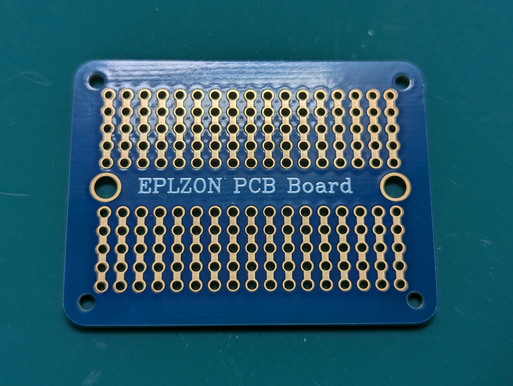
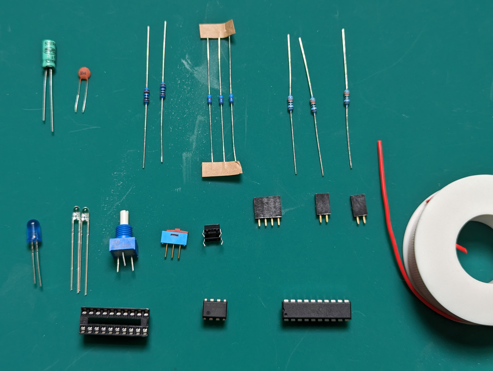

# Materials for the clock module

The build is designed to be made on a 1/4 size solderable breadboard (17 holes wide,
10 tall), with tracks. Like this:

# Components

* C1: 1 µF (timing capacitor)
* C2: 0.1 µF (decoupling capacitor)
* R1: 1 KΩ (discharge resistor)
* R2: 1 KΩ (charge resistor)
* 3 x RP: 10 KΩ (pull-up/pull-down resistors)
* 3 x RL: 330 Ω (LED protection. You can change this if you like your LEDs brighter/dimmer)
* LED: blue 5mm LED (clock output indicator. You can use a 3mm if you prefer)
* 2 x LEDI: green 3mm LED (mode indicator)
* POT: 1 MΩ linear potentiometer (speed control. Make sure it's not too bulky, space is tight)
* BUT: push button, normally open (single-step button)
* SWI: SPDT switch, 3 inline pins. (mode selector. Make sure it's a narrow one to fit the allocated place)
* CONN_CLK: 4 way, single row socket (connector for clock output. It's convenient to have a multiway connector to attach to multiple circuits, but you can do with less ways if you prefer).
* CONN_HLT_GND: 2 way, single row PCB socket (connector for GND and HLT lines)
* CONN_VCC: 2 way, single row PCB socket (connector for VCC. if you get a 1-way it may be easier to place, but I couldn't find those).
* U1: 555 (timer IC)
* U2: ATF16V8B (Simple programmable logic device)
* a DIP-20 socket for U2 (not required, but strongly recommended)
* some jumper wires
  
Here's a picture of everything, labeled:

I've added some nylon "legs" which are M2 nylon spacers + nylon nuts; but the size of
those may depend on the specific solderable board you use. This is still completely
optional.

